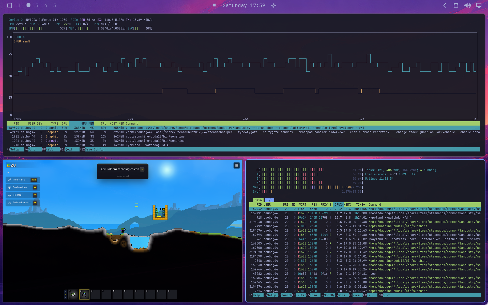

# GTX 1050 Mobile Optimus passthrough su Proxmox

Repository didattico e operativo per assegnare la GPU NVIDIA discreta di un portatile HP a una VM Linux Proxmox. Il caso recuperato qui non è un normale passthrough desktop: è una GPU **NVIDIA Optimus/mobile** a cui il driver richiede la VBIOS attraverso ACPI.


## Prima dei comandi: dove sei e cosa stai guardando

Questa guida usa sempre tre contesti. Leggerli evita l'errore piu comune: lanciare un comando della VM sul nodo Proxmox, o viceversa.

| Etichetta | Che cos'e | Esempi di comandi che vanno eseguiti qui |
| --- | --- | --- |
| **[NODO]** | Il computer fisico che esegue Proxmox. In questo progetto e il laptop HP. Ha la GPU fisica e i comandi `qm`, `lspci` e `gpu-vm-switch`. | `lspci -nnk -s 0000:02:00.0`, `qm config 1001` |
| **[VM]** | Il computer virtuale dentro Proxmox. Qui sono Ubuntu `1001` e Kali `1000`. Il driver NVIDIA viene installato qui, non sul nodo. | `nvidia-smi`, `mokutil --sb-state` |
| **[PC DI AMMINISTRAZIONE]** | Il PC dal quale apri SSH/noVNC e modifichi il repository. Non e parte del passthrough. | `git status`, lettura del PDF |

Un blocco che inizia con `# [NODO]` va eseguito come `root` sul server Proxmox. Uno che inizia con `# [VM]` va eseguito dentro la VM indicata, tramite console noVNC o SSH alla VM. `noVNC` e la console grafica nel pannello Proxmox: serve quando devi vedere schermate prima dell'avvio di Linux, come MOK Manager.

> Il popup `abc` di Caps Lock del laptop Lenovo Windows non appartiene a questi
> tre contesti: e' gestito dal driver locale Lenovo. La diagnosi e la correzione
> mirata sono in [Caps Lock sul client Lenovo Windows](docs/lenovo-windows-caps.md).

## Dizionario essenziale: nessun gergo sottinteso

| Termine | Significato semplice | Perche compare qui |
| --- | --- | --- |
| **Host / nodo Proxmox** | Il computer fisico che ospita le VM. | E l'unico che possiede davvero la GTX 1050. |
| **Guest / VM** | Un computer virtuale in esecuzione nel nodo. | Ubuntu e Kali sono guest; una sola alla volta puo ricevere la GPU. |
| **VMID** | Il numero che identifica una VM per Proxmox. | `1001` identifica Ubuntu; `1000` identifica Kali. |
| **GPU** | Processore grafico, qui la NVIDIA GTX 1050 Mobile. | E il dispositivo da assegnare alla VM. |
| **PCIe** | Il bus hardware attraverso cui il nodo vede la GPU. | Il passthrough comincia assegnando questo dispositivo fisico alla VM. |
| **BDF** | Indirizzo PCI nel formato `dominio:bus:dispositivo.funzione`. | `0000:02:00.0` significa dominio `0000`, bus `02`, dispositivo `00`, funzione grafica `0`. |
| **PCI ID** | Codice `vendor:device` del modello PCI. | `10de:1c8d` significa NVIDIA (`10de`) GTX 1050 Mobile (`1c8d`). |
| **IOMMU** | Funzione CPU/chipset che isola il DMA e rende possibile assegnare un dispositivo PCI a una VM. Intel la chiama VT-d, AMD AMD-Vi. | Senza IOMMU non esiste passthrough PCI sicuro. |
| **VFIO / `vfio-pci`** | Driver Linux che prende possesso della GPU per consegnarla a QEMU, invece di usarla nel nodo. | `lspci -nnk` deve mostrare `Kernel driver in use: vfio-pci`. |
| **QEMU / Q35** | QEMU esegue la VM; Q35 e il chipset PCIe virtuale moderno che QEMU emula. | Lo script richiede Q35 per ottenere una topologia PCI guest gestibile. |
| **OVMF / SeaBIOS** | Firmware della VM: OVMF equivale a UEFI, SeaBIOS al BIOS tradizionale. | Ubuntu usa OVMF; Kali SeaBIOS. Il test ha coperto entrambi. |
| **QEMU Guest Agent (QGA)** | Piccolo servizio nella VM che permette al nodo di eseguire controlli al suo interno. | Lo script scopre la distro, il percorso PCI guest e il driver senza indovinare. |
| **VBIOS / file `.rom`** | Firmware interno della GPU. Qui il file `.rom` e una copia della VBIOS OEM HP. | Il driver NVIDIA Mobile chiede questi byte per inizializzarsi. |
| **ACPI** | Tabelle/metodi con cui firmware e sistema operativo descrivono dispositivi hardware. | Sui laptop Optimus il driver usa ACPI per chiedere la VBIOS. |
| **DSDT / SSDT** | DSDT: tabella ACPI principale. SSDT: tabella aggiuntiva. | Lo script aggiunge una SSDT; non modifica la DSDT originale. |
| **ASL / AML** | ASL e il testo leggibile della SSDT; AML e il bytecode compilato che QEMU carica. | `iasl` trasforma ASL in AML; il self-test controlla questa compilazione. |
| **`fw_cfg`** | Canale QEMU che consegna un file binario al guest. | Trasporta la VBIOS OEM dal nodo alla SSDT. Da solo non basta. |
| **`_ROM(offset, length)`** | Metodo ACPI: il driver chiede una fetta di firmware indicando inizio e lunghezza. | La SSDT restituisce al driver i byte VBIOS ricevuti da `fw_cfg`. |
| **Secure Boot / MOK / DKMS** | Secure Boot accetta moduli firmati; DKMS li compila; MOK e la chiave che l'utente autorizza prima del boot. | Spiega perche un driver installato puo non caricarsi. |
| **`nvidia-smi` / `nvtop` / `nvidia-glxgears`** | Strumenti NVIDIA: stato driver/VRAM, uso GPU e ingranaggi OpenGL con FPS. | Insieme distinguono “driver visto” da “rendering sulla GPU”. |

Il [glossario esteso](docs/glossary.md) approfondisce ogni voce; questa tabella e qui per rendere comprensibile il README senza dover conoscere gia il gergo.

### I comandi e le opzioni usati nei test

| Comando/opzione | Cosa fa, senza abbreviazioni |
| --- | --- |
| `cat /proc/cmdline` | Stampa i parametri con cui Linux e stato avviato. Qui cerca le opzioni che attivano IOMMU. Non modifica niente. |
| `test -d percorso` | Controlla se un percorso esiste ed e una directory. Qui verifica l'esistenza dei gruppi IOMMU. Non modifica niente. |
| `lspci -nnk -s BDF` | Elenca il dispositivo PCI all'indirizzo BDF, il PCI ID numerico e il driver Linux che lo sta usando. Non modifica niente. |
| `qm` | Comando amministrativo di Proxmox per leggere o gestire VM: `qm config` legge la configurazione, `qm status` legge lo stato, `qm guest exec` esegue un comando attraverso il Guest Agent. |
| `iasl` | Compilatore/disassemblatore ACPI. Trasforma ASL in AML e puo rileggere AML per controllarlo. |
| `sha256sum` | Calcola un'impronta lunga del file. Due file con hash SHA-256 uguale sono, in pratica, lo stesso contenuto byte per byte. |
| `--dry-run` | Modalita di simulazione dello script: mostra proprietario/azioni previste senza scrivere file, fermare VM o riavviare. |
| `--yes` | Salta la domanda di conferma. Non disabilita Secure Boot da solo: per quello serve anche `--disable-secure-boot`. |
| `--self-test` | Genera una SSDT fittizia, la compila con `iasl` e la disassembla. E un test del generatore ACPI, non del driver NVIDIA. |

## Cosa e stato testato davvero: comando, macchina, risultato e limite

La tabella non mescola prova reale, controllo del codice e funzionalita non ancora provata. Un successo dimostra solo cio che il comando osserva.

| Test | Dove e con che cosa | Comando o evidenza | Risultato osservato | Cosa dimostra / non dimostra |
| --- | --- | --- | --- | --- |
| IOMMU attivo | [NODO], kernel Proxmox | `cat /proc/cmdline` e `test -d /sys/kernel/iommu_groups` | Flag IOMMU attivi e gruppi presenti. | Il nodo puo isolare PCI; non prova che ogni gruppo sia sicuro. |
| GPU presa da VFIO | [NODO], `lspci` | `lspci -nnk -s 02:00.0` | `Kernel driver in use: vfio-pci`. | La GPU non e usata dal driver grafico del nodo e puo essere data a QEMU. |
| SSDT generabile | [NODO], `iasl` | `gpu-vm-switch --self-test` | `self-test: ok`. | L'ASL di prova compila/disassembla in AML; non prova ancora il driver guest. |
| Preparazione idempotente | [NODO], script in simulazione | `gpu-vm-switch --prepare-host --rom-source /usr/share/kvm/gtx1050_hp_native.rom --dry-run --yes` | Nessuna scrittura e nessun reboot. | Il preflight e ripetibile senza toccare il nodo. |
| Ubuntu -> Kali -> Ubuntu | [NODO], `gpu-vm-switch` | `gpu-vm-switch --vm 1000 --yes`, poi `gpu-vm-switch --vm 1001 --yes` | Cleanup, discovery PCI/ACPI e SSDT riusciti in entrambe le direzioni. | Il trasferimento OVMF/Q35 <-> SeaBIOS/Q35 e reale; non certifica altri laptop. |
| Driver su Ubuntu | [VM Ubuntu], `nvidia-smi` | `nvidia-smi --query-gpu=name,driver_version,memory.total --format=csv,noheader` | `NVIDIA GeForce GTX 1050, 580.173.02, 4096 MiB`. | Driver e VRAM sono visibili; non e un benchmark. |
| Rendering OpenGL | [VM Ubuntu], desktop Wayland/Xwayland | `glxinfo -B`, `nvidia-smi`, `nvtop`, `glxgears` | Renderer `NVIDIA GeForce GTX 1050/PCIe/SSE2`; `glxgears` visibile ~60 FPS con VSync RDP. | 60 FPS e' il refresh virtuale, non il limite GPU; il vecchio Xorg `:2` e' soltanto un supporto diagnostico headless. |
| Idempotenza switch | [NODO], script | `gpu-vm-switch --vm 1001 --mok-manual --yes` con Ubuntu gia pronta | Messaggio idempotente, nessuna riscrittura o riavvio. | Ripetere il comando non riconfigura una GPU gia collegata. |
| RDP Wayland | [VM Ubuntu], GNOME Remote Login + `mstsc` Windows | Profilo [RDSTLS](clients/windows-rdstls-template.rdp), `Documents\Default.rdp` corretto a `use redirection server name:i:1`, snapshot e backport locale `gnome-settings-daemon` | L'audio playback su Windows e' stato confermato manualmente; il server emette `Sending server redirection`; il profilo `.rdp` e' stato riferito funzionante. | La patch impedisce che `gsd-sharing` spenga l'hand-over con il daemon RDP di sistema ancora vivo; `Default.rdp` fa usare RDSTLS anche alla GUI diretta. Resta da fare una prova visiva diretta greeter -> desktop dopo la correzione; vedi [diagnosi RDP](docs/rdp-wayland.md). |
| Disabilitazione Secure Boot | Non eseguita su Ubuntu principale | Revisione del codice e del prompt soltanto. | **Nessuna prova runtime dichiarata.** | Richiede snapshot e noVNC; non e dichiarata risolta/testata. |

## Perche funziona in questo HP, in sette passaggi

Non e un trucco ne una ROM generica. La catena che ha prodotto il risultato e questa:

1. IOMMU e `vfio-pci` liberano la GPU dal driver grafico del nodo e la rendono assegnabile a QEMU.
2. `hostpci` collega il dispositivo fisico alla VM. Questo da alla VM una GPU PCI, ma non le da automaticamente il firmware nel formato richiesto dal driver mobile.
3. Lo script avvia una prima volta la VM e, tramite QEMU Guest Agent, legge il suo percorso PCI. Da quel percorso calcola il **nome ACPI guest** corretto della GPU.
4. Il file VBIOS OEM HP integro viene esposto da QEMU attraverso `fw_cfg`.
5. Lo script genera una SSDT AML per quello specifico percorso ACPI; la SSDT legge `fw_cfg` e conserva il firmware nel buffer `FWBI`.
6. Quando il driver NVIDIA chiama `_ROM(offset, length)`, la SSDT restituisce la porzione di VBIOS che il driver ha chiesto. E qui che il precedente passthrough con sola ROM BAR falliva.
7. Il driver si inizializza e puo renderizzare senza pannello fisico grazie al display NVIDIA headless `:2`, poi provato con `nvidia-smi`, `nvidia-glxgears` e `nvtop`.

La spiegazione visuale e:

~~~text
GPU fisica -> IOMMU + vfio-pci -> hostpci/QEMU -> GPU PCI nella VM
VBIOS OEM  -> QEMU fw_cfg       -> SSDT AML    -> _ROM() -> driver NVIDIA
                                                              |
                                                              v
                                                nvidia-smi + rendering headless
~~~

Il documento [matrice dei claim laptop](docs/laptop-passthrough-claim-matrix.md) risponde punto per punto a Optimus muxless, ROM/VBIOS, FLR/reset, D3cold/_DSM, gruppi IOMMU/ACS, Code 43 Windows e alternative. Specifica sempre se un'affermazione e **provata qui**, solo un **rischio generale** oppure **non testata/non applicabile**.

## Prova dello switch: Ubuntu -> Kali -> Ubuntu

Questo non è solo un progetto teorico. Lo switch reale è stato eseguito tra le due VM presenti sul nodo:

| Passo | VM sorgente | VM destinazione | Esito |
| --- | --- | --- | --- |
| 1 | Ubuntu `1001` | Kali `1000` | GPU scollegata, SSDT dinamica rigenerata per Kali e avvio completato. |
| 2 | Kali `1000` | Ubuntu `1001` | GPU restituita a Ubuntu, SSDT rigenerata e driver NVIDIA operativo. |
| Verifica finale | Ubuntu `1001` | - | `NVIDIA GeForce GTX 1050`, driver `580.173.02`, 4096 MiB e rendering `glxgears` reale. |

Questa prova valida il trasferimento tra firmware guest diversi (Kali SeaBIOS/Q35, Ubuntu OVMF/Q35) e il cleanup della configurazione generata. Non prova automaticamente ogni possibile portatile, GPU o installatore driver di ogni distribuzione: il workaround rimane specifico alle NVIDIA mobile/Optimus che chiedono `_ROM`.

## Macchina verificata e perimetro

| Voce | Valore osservato |
| --- | --- |
| Portatile | HP Pavilion Laptop **15-cs1xxx** |
| Scheda madre | HP `856A` |
| GPU | NVIDIA GP107M GeForce GTX 1050 Mobile (Pascal) |
| PCI host | BDF `0000:02:00.0`, ID `10de:1c8d`, driver host `vfio-pci` |
| VBIOS OEM | `86.07.5F.00.2C`, 169472 byte, SHA-256 `33abd3bc3f658b0536da0617a76076b56e5af124701271211d6d127cda22c322` |
| Host | Proxmox VE 9.1.5, kernel `6.17.9-1-pve` |
| Guest validati | Ubuntu OVMF/Q35 e Kali SeaBIOS/Q35 |

La GTX 1050 laptop usa la microarchitettura **Pascal** e ha 640 CUDA core; in questa VM sono stati visti 4 GiB di VRAM. Il dettaglio decisivo non è il numero dei core ma l'architettura **Optimus muxless**: il pannello interno resta collegato alla iGPU Intel, mentre la NVIDIA è un acceleratore PCIe render-only. Perciò può elaborare CUDA/OpenGL/Vulkan senza possedere un display fisico o un CRTC DRM assegnabile.

Questa procedura è progettata soprattutto per NVIDIA mobile/Optimus con richiesta ACPI `_ROM`. Può essere adattata ad altre GPU mobile, ma non è perfetta né universale: occorrono topologia compatibile, IOMMU, BDF, VBIOS OEM della stessa macchina e test reale. Se un altro portatile dà errori, va analizzato e il generatore SSDT potrebbe dover essere modificato; non usare una ROM casuale desktop o di un altro produttore.

## Prima di iniziare: cosa serve davvero

Salvo indicazione contraria, i blocchi delle sezioni 1-4 qui sotto sono comandi [NODO]: eseguili come root nel terminale del nodo Proxmox, non dentro Ubuntu o Kali.

### 1. Firmware del portatile: operazione manuale

Nel BIOS/UEFI del portatile devono essere abilitati virtualizzazione CPU e IOMMU: su Intel di solito **Intel VT-d**, su AMD **AMD-Vi/IOMMU**. Uno script Linux non può cambiare il BIOS del portatile in modo affidabile: questo è l'unico prerequisito host che va verificato manualmente. Dopo il boot Proxmox deve esistere `/sys/kernel/iommu_groups`.

### 2. Preparazione idempotente del nodo Proxmox

Dal clone di questo repository, sul nodo Proxmox:

```bash
# [NODO] come root
install -m 0750 scripts/gpu-vm-switch /usr/local/sbin/gpu-vm-switch

# Installa solo acpica-tools/pciutils mancanti, copia la ROM se differente,
# aggiunge IOMMU e vfio-pci solo se necessari, aggiorna initramfs e segnala il reboot.
gpu-vm-switch --prepare-host \
  --rom-source ./firmware/gtx1050_hp_native.rom --yes

# Solo se il comando segnala un riavvio richiesto; questo riavvia davvero il nodo.
gpu-vm-switch --prepare-host \
  --rom-source ./firmware/gtx1050_hp_native.rom --reboot --yes
```

`--prepare-host` rileva Intel/AMD, aggiorna `/etc/kernel/cmdline` con `intel_iommu=on` o `amd_iommu=on` più `iommu=pt` quando il nodo usa `proxmox-boot-tool`; altrimenti aggiorna la riga GRUB. Crea o aggiorna soltanto il proprio file `/etc/modprobe.d/gpu-vm-switch-vfio.conf`, conservando gli ID già gestiti, aggiunge i tre moduli VFIO a `/etc/modules` solo se assenti e rigenera l'initramfs solo se occorre. Non scollega a caldo la GPU e non riavvia senza `--reboot`.

Il comando è **idempotente**: una seconda esecuzione non riscrive la ROM identica, non duplica flag, moduli o ID PCI e non aggiorna l'initramfs se non è cambiato nulla. Il binding `vfio-pci.ids=10de:1c8d` opera per ID PCI: su una macchina con più GPU identiche va verificato con attenzione.

La sequenza completa, con comandi di inventario, `--dry-run`, applicazione, reboot, verifica nodo/guest, MOK e rendering, è nel [runbook riproducibile](docs/reproducible-runbook.md). Seguilo nell'ordine: evita di modificare manualmente `hostpci` o `args` tra preflight e switch.

Controlli dopo il reboot:

```bash
# [NODO] come root, dopo esserti ricollegato al nodo
cat /proc/cmdline                 # deve contenere intel_iommu=on oppure amd_iommu=on e iommu=pt
test -d /sys/kernel/iommu_groups && echo IOMMU-ok
lspci -nnk -s 02:00.0            # deve indicare Kernel driver in use: vfio-pci
gpu-vm-switch --self-test        # compila e disassembla una SSDT di test
```

### 3. ROM/VBIOS OEM

La ROM impiegata in questo caso è inclusa come [`firmware/gtx1050_hp_native.rom`](firmware/gtx1050_hp_native.rom): è il blob estratto dal payload originale HP per questo Pavilion e coincide byte per byte con quello provato sul nodo. Va trattata come firmware OEM, non come una ROM generica riutilizzabile.

Il comando `--prepare-host --rom-source ...` la installa, senza sovrascrivere se l'hash è già identico, in `/usr/share/kvm/gtx1050_hp_native.rom`. Se la ROM va estratta di nuovo dal pacchetto HP, usa:

```bash
# [NODO] come root; /tmp/084C0.bin e il payload gia estratto dal pacchetto HP
python3 scripts/extract_gtx1050_rom.py /tmp/084C0.bin \
  --device-id 1c8d \
  --output /usr/share/kvm/gtx1050_hp_native.rom
```

Lo script Python non scarica né inventa firmware: cerca `55 aa`, l'header `PCIR`, vendor NVIDIA e device `1c8d` nel payload RAW e negli stream LZMA, poi ricostruisce le immagini Legacy/GOP fino al flag finale. Il payload di partenza era stato estratto localmente dal pacchetto driver/firmware ufficiale HP relativo al portatile.

### 4. VM e guest

La VM di destinazione deve usare **Q35** e il **QEMU Guest Agent**. Può mantenere il proprio firmware: Ubuntu qui usa OVMF, Kali SeaBIOS; lo script non cambia `bios`, `machine`, `vga`, memoria o dischi. Lo switch gestisce driver per Ubuntu, Debian, Kali, Arch, Fedora, RHEL, Rocky e AlmaLinux. Per altre distribuzioni si usa `--skip-drivers` e si installa il driver secondo la documentazione della distro.

### Nota essenziale per Arch/Omarchy e GTX 1050

La GTX 1050 Mobile è Pascal e **non ha il GSP** (*GPU System Processor*) richiesto da `nvidia-open-dkms`. Su Omarchy il pacchetto open `610.xx` dichiara anche `Provides: nvidia-dkms`: chiedere semplicemente `nvidia-dkms` installava quindi il modulo sbagliato, pur avendo DKMS completato senza errori. Il sintomo era `nvidia-smi` non comunicante e il kernel riportava che la GPU non era supportata da `nvidia.ko` open.

Per il PCI ID di questo progetto (`10de:1c8d`) lo script cerca esplicitamente il ramo proprietario `nvidia-580xx-dkms` e `nvidia-580xx-utils`; su Omarchy essi sono disponibili nel repository `omarchy`. La sostituzione è idempotente: se il ramo 580xx è già presente non rimuove nulla; se trova quello open, rimuove solo i due pacchetti in conflitto e installa subito i loro sostituti. Se un'altra Arch-like non offre il ramo proprietario, il tool si ferma invece di installare silenziosamente il driver open incompatibile. Per GPU più recenti il ramo Arch standard può essere corretto, ma va verificato rispetto al modello effettivo.

### Omarchy: desktop Wayland e Moonlight sulla GTX, senza assumere un monitor fisico

La GTX mobile di questa VM non ha un connettore HDMI/DP guest collegato. Non forzare un EDID sul connettore disconnesso: il test ha lasciato il guest non raggiungibile e i parametri sono stati rimossi. La soluzione verificata usa invece Hyprland in modalita' headless sulla GTX e un'uscita Wayland virtuale `omarchy-gtx`. Il fallback inattivo e' 1920x1200/60, ma Desktop di Moonlight passa a Sunshine W×H×FPS richiesti: un hook idempotente usa `hyprctl eval` e `hl.monitor(...)` per cambiare quell'unico output prima della cattura. Durante Moonlight il campione HEVC ha mostrato 60.19 FPS, 7.9 ms di latenza host media, 0% drop e `sunshine enc=28` in `nvidia-smi pmon`: NVENC e' quindi attivo. I file PVE e guest, il loro significato, il comando idempotente di risoluzione e la prova riproducibile sono in [setup Omarchy PVE/guest](docs/omarchy-proxmox-guest-setup.md).

Lo strumento guest idempotente e' [scripts/omarchy-gtx-primary](scripts/omarchy-gtx-primary): crea l'uscita prima di Sunshine, conserva i backup, installa le funzioni Bash `omarchy_stream_resolution` e `omarchy_stream_health` e offre verifica, controllo fallback e rollback. A ogni nuova apertura Desktop, Moonlight comunica W×H×FPS e il relativo hook Sunshine applica quella modalita' al solo output headless GTX; non crea due desktop distinti per due client contemporanei. Questa integrazione e' volutamente specifica: Sunshine passa i parametri a un prep command ma non puo' conoscere in modo universale l'API e l'output headless di ogni compositor Wayland. Il tool Windows [moonlight-windows-settings.ps1](clients/moonlight-windows-settings.ps1) replica il bitrate predefinito Moonlight (46 Mbps per il profilo attuale 1920x1200/60/YUV 4:4:4) oppure permette un valore fisso. Per un altro PC Fedora, [omarchy-client-setup-fedora.sh](clients/omarchy-client-setup-fedora.sh) installa Moonlight Flatpak, KDE Connect e il watcher microfono senza IP o password nel codice. Il pairing KDE Connect resta manuale. Non cambia VFIO, VBIOS, SSDT, kernel o Limine. La guida completa, inclusa la cronologia RDP -> Sunshine -> HEVC, la spiegazione della CPU residua (`GPU -> RAM -> GPU` nel build compatibile), clipboard, TV, la prova del fallimento del pacchetto Sunshine ufficiale e i comandi riproducibili e' in [Sunshine/Moonlight su Omarchy](docs/sunshine-moonlight-omarchy.md).



Il tiling manager e' Hyprland: lo screenshot mostra Sandustry, `nvtop` e `btop`
organizzati sul monitor headless `omarchy-gtx`, con la GPU realmente in uso. Il
[tutorial completo del tiling manager](docs/omarchy-tiling-tutorial.md) spiega
workspace, split, resize, scratchpad Steam, gruppi, multi-monitor e le
scorciatoie effettive (`Caps Lock` e' `SUPER` in questo setup).

Moonlight/Sunshine inviano tastiera, mouse e l'audio del guest, ma non trasformano il microfono del PC client in una sorgente PipeWire della VM. Per il dettato realtime nella VM esistono [voxtype-windows-mic-rtp.ps1](clients/voxtype-windows-mic-rtp.ps1) e [voxtype-fedora-mic-rtp.sh](clients/voxtype-fedora-mic-rtp.sh): FFmpeg cattura la sorgente locale e invia Opus/RTP a pacchetti da 20 ms; [voxtype-remote-mic-rtp-receive](scripts/voxtype-remote-mic-rtp-receive) lo pubblica nella VM come `voxtype_remote_mic.monitor`. Il watcher parte al login ma apre FFmpeg soltanto quando Moonlight e la VM richiedono il microfono: PTT VoxType oppure un client PipeWire come Discord. La porta UDP e' limitata nel firewall all'IP del PC client; il controllo `active/idle` viaggia in una SSH dedicata e ristretta. Il precedente tunnel SSH cifrato resta come fallback. Vedi la guida completa [Microfono Windows in VoxType via Moonlight](docs/voxtype-moonlight-microphone.md), inclusi IP/porta configurabili, configurazione di un secondo PC, VAD e verifiche.

Per applicare o ripetere il setup senza IP fissati nel codice, usare la CLI [omarchy-setup](scripts/omarchy-setup) con il file locale ignorato `config/omarchy.env`; il lato client usa [omarchy-client-setup.ps1](clients/omarchy-client-setup.ps1) su Windows oppure il modulo `client fedora` su Fedora. I moduli separano correttamente nodo PVE (GPU/VFIO), guest Omarchy (Sunshine e ricevitore microfono) e client (Moonlight, chiave e autostart). La [guida CLI centralizzata](docs/centralized-setup-cli.md) contiene percorsi effettivi, comunicazione tra processi, comandi per un secondo PC e le prove versionate di HEVC/NVENC, trascrizione e VRAM VoxType. Gli errori ACPI periodici del nodo HP sono distinti dalla VM e spiegati in [diagnosi ACPI PVE](docs/proxmox-host-acpi.md).

Per una GTX Pascal con il ramo NVIDIA `580xx`, l'azione Omarchy **Gaming → Steam** e' corretta localmente dal modulo `guest steam fix`: fa risolvere a Pacman `lib32-nvidia-580xx-utils` nella stessa transazione di Steam, invece del provider generico che dipende da NVIDIA 610 e va in conflitto. Il comando aggiuntivo `guest nvidia pin --apply` protegge invece **tutto il sistema**: permette aggiornamenti del ramo `580xx`, ma blocca prima della transazione una sostituzione con il ramo generico/open o 610. Hyprland resta il desktop Wayland sulla GTX e XWayland e' soltanto un fallback mirato per un'applicazione che abbia dimostrato un difetto nel backend nativo. Il modulo `guest steam fallback enable Sandustry --apply` salva e modifica esclusivamente le Launch Options dell'AppID richiesto, con rollback esatto; accetta anche il nome esatto del gioco installato e non forza X11 alle altre app Electron o Steam. Nella shell della VM basta `steam-x11 Sandustry`: l'alias gestisce i privilegi solo internamente. Un hook Pacman riapplica la correzione Steam dopo ogni aggiornamento di Omarchy. Se un mirror restituisce un `404`, aggiornare la VM con `omarchy update` (non con `pacman -Syu` diretto): Omarchy aggiunge snapshot, keyring, migrazioni e hook, poi si riapre l'azione Gaming → Steam.

| Prova Omarchy | Evidenza versionata | Cosa dimostra |
| --- | --- | --- |
| Stream Moonlight | [HEVC 1920x1200 ~60 FPS, zero drop e NVENC](evidence/moonlight-hevc-nvtop-idle-model-unloaded.png) | Il desktop headless viene catturato e codificato dalla GTX; nel fermo immagine idle il modello VoxType non resta residente. |
| Dettatura | [Notifica `Ciao, come stai?` e grafico NVTOP](evidence/voxtype-transcription-nvtop-on-demand.png) | Il percorso microfono Windows -> RTP/Opus -> PipeWire -> VoxType completa una trascrizione nella VM. |
| VRAM VoxType | [Worker VoxType in elaborazione](evidence/voxtype-model-vram-during-transcription.png) | Il modello usa GPU quando trascrive (circa 469 MiB osservati), mentre l'OSD resta leggero a riposo. |

## Uso quotidiano dello switch

```bash
# [NODO] come root. Non lanciare questi comandi dentro la VM.
# Menu numerato delle VM e domanda Secure Boot quando utile.
gpu-vm-switch

# Sposta la GPU alla VM 1001. Se la GPU è già pronta, non cambia nulla.
gpu-vm-switch --vm 1001 --yes

# Simula proprietario attuale e destinazione: nessuna modifica.
gpu-vm-switch --vm 1001 --dry-run --yes

# Altra NVIDIA mobile: BDF senza .funzione e VBIOS OEM corrispondente.
gpu-vm-switch --gpu 0000:03:00 --rom /usr/share/kvm/altra-oem.rom --vm 123 --yes

# Driver già preparato manualmente.
gpu-vm-switch --vm 123 --skip-drivers --yes
```

Il flusso è:

1. Cerca in tutte le VM chi ha `hostpci` per quella GPU.
2. Arresta con `qm shutdown` le sole VM coinvolte.
3. Rimuove dalla sorgente soltanto `hostpci`, `romfile`, `rombar`, `-acpitable`, `-fw_cfg` e `cpu=host,hidden=1` generati da questo strumento; riaccende la sorgente, se era accesa, senza GPU.
4. Collega la GPU alla destinazione con `rombar=0`, avvia una volta, scopre il percorso PCI/ACPI e genera la SSDT `.aml` specifica.
5. Riavvia la destinazione con SSDT e VBIOS, installa/verifica il driver e riattiva il benchmark opzionale.

È idempotente in due sensi: una GPU già pronta (`hostpci` + SSDT + `fw_cfg` + `nvidia-smi`) non provoca né scritture né riavvii; se la configurazione esiste ma il driver è bloccato da MOK, lascia la configurazione invariata e verifica solo driver/MOK, senza ripetere un trasferimento distruttivo.

Il comando completo è disponibile con `gpu-vm-switch --help`.

+## Output completo di `gpu-vm-switch --help`

L'output seguente è copiato automaticamente dal file dello script durante la validazione: se lo script cambia, la verifica fallisce finché questo blocco non viene aggiornato.

~~~text
Uso:
  gpu-vm-switch                         menu interattivo delle VM
  gpu-vm-switch --vm VMID --yes         trasferimento non interattivo
  gpu-vm-switch --vm VMID --dry-run     simulazione senza modifiche
  gpu-vm-switch --prepare-host           prepara i prerequisiti del nodo Proxmox

Opzioni:
  --vm VMID           VM Proxmox che ricevera la GPU
  --gpu 0000:BB:DD    GPU del nodo (default: 0000:02:00)
  --rom /percorso.rom VBIOS OEM da esporre alla VM
  --skip-drivers      non installa/aggiorna il driver nel guest
  --mok-manual        conserva Secure Boot e guida il passaggio MOK manuale
  --disable-secure-boot
                      disabilita Secure Boot in modo permanente per una VM OVMF
                      creando nuove variabili EFI senza chiavi; conserva una copia
                      ripristinabile delle vecchie variabili sul nodo Proxmox
  --prepare-host      installa gli strumenti host, configura IOMMU/VFIO e la ROM
  --rom-source FILE   file VBIOS OEM sorgente da installare sul nodo con --prepare-host
  --reboot            riavvia il nodo soltanto dopo --prepare-host e conferma esplicita
  --yes               non chiede conferma
  --dry-run           non modifica nulla
  --self-test         compila/disassembla una SSDT di prova
  -h, --help          mostra questo aiuto

Casi d'uso:
  Ubuntu:                       gpu-vm-switch
  Debian/Kali/Fedora/RHEL:       gpu-vm-switch --vm 123 --yes
  Omarchy + GTX 1050 Pascal:     gpu-vm-switch --vm 123 --yes
  Arch con GPU recente:          gpu-vm-switch --vm 123 --yes
  Driver gia gestito da te:     gpu-vm-switch --vm 123 --skip-drivers --yes
  OVMF senza MOK/Secure Boot:   gpu-vm-switch --vm 123 --disable-secure-boot --yes
  OVMF con Secure Boot/MOK:     gpu-vm-switch --vm 123 --mok-manual
  Prepara host dal repository:  gpu-vm-switch --prepare-host --rom-source ./firmware/gtx1050_hp_native.rom --yes
  Prepara host e riavvia:       gpu-vm-switch --prepare-host --rom-source ./firmware/gtx1050_hp_native.rom --reboot --yes
  Altra NVIDIA mobile/Optimus:  gpu-vm-switch --gpu 0000:03:00 --rom /usr/share/kvm/oem.rom --vm 123 --yes

La VM di destinazione deve usare Q35, SeaBIOS o OVMF, e avere il QEMU Guest Agent attivo.
Se il disco del guest e cifrato con LUKS, dopo ogni avvio necessario allo switch
devi sbloccarlo dalla console noVNC: la passphrase non viene e non deve essere
automatizzata dallo script.
Il trasferimento e idempotente: se la GPU e gia pronta sulla VM scelta non
riavvia o modifica nulla. Le VM sorgenti che erano accese vengono riaccese
automaticamente senza la GPU alla fine, anche se lo switch incontra un errore.
Quando una VM perde la GPU vengono rimossi hostpci, ROM, SSDT, fw_cfg e le
opzioni CPU specifiche del passthrough; firmware e chipset restano invariati.
Se Secure Boot e attivo, il menu interattivo propone di disattivarlo. In modalita
--yes non viene mai disattivato senza l'opzione esplicita --disable-secure-boot.
--mok-manual non prova a premere MOK Manager: conserva Secure Boot, verifica se
il driver parte e stampa il passaggio da completare dalla console noVNC quando serve.
L'operazione Secure Boot e permanente: evita MOK, ma sostituisce solo le variabili
EFI dopo avere creato un fallback di boot e una copia ripristinabile delle vecchie.
Se il nuovo EFI non completa il primo boot fino al Guest Agent, lo script ripristina
automaticamente efidisk0 originale; prima dell'uso e comunque consigliato uno snapshot.
~~~

Per il guest Omarchy dedicato, questo vincolo pre-boot e' stato risolto senza
inserire una passphrase negli script: [vTPM Proxmox + token LUKS2
`systemd-cryptenroll`](docs/centralized-setup-cli.md#luks-auto-unlock-con-vtpm-configurazione-effettiva-e-modello-di-sicurezza).
La passphrase LUKS resta comunque il recupero manuale.


## Perché il solo passthrough PCI non basta in Optimus

Con una scheda desktop, `hostpci` e talvolta `romfile=...` esponendo la finestra ROM PCI possono bastare. Qui no. Su un portatile Optimus il driver NVIDIA può chiedere la VBIOS al firmware della scheda madre tramite il metodo ACPI standard **`_ROM(offset, length)`** associato al device ACPI della GPU. Questo riflette la progettazione laptop: alimentazione, muxless graphics e firmware sono coordinati dalla piattaforma ACPI, non solo dal bus PCIe.

`rombar=1` rende una ROM nella configurazione PCI virtuale, ma non crea quel metodo ACPI. Per questo i tentativi con sole ROM/`romfile`/`rombar` non hanno inizializzato il driver. Il workaround consegna **lo stesso blob VBIOS OEM** a QEMU tramite `fw_cfg`, poi aggiunge una SSDT compilata che implementa `_ROM` sul device GPU corretto:

```text
file .rom OEM -> QEMU fw_cfg -> SSDT AML -> _ROM(offset, length) -> driver NVIDIA
```

Lo stesso flusso, senza abbreviazioni:

```text
file gtx1050_hp_native.rom sul nodo Proxmox
        |
        v
QEMU fw_cfg: espone il blob al guest a ogni avvio
        |
        v
SSDT AML: legge il blob e lo conserva nel buffer FWBI
        |
        v
metodo ACPI _ROM(offset, length): restituisce i byte richiesti
        |
        v
driver NVIDIA nella VM: inizializza la GTX 1050 Mobile
```

`fw_cfg` è solo un canale QEMU per byte; non capisce NVIDIA. La SSDT legge il blob una volta, lo tiene in un buffer AML e restituisce al driver la fetta richiesta. Quindi VBIOS e file `.rom` qui sono lo stesso firmware, mentre `rombar` è un'altra cosa: la finestra ROM PCI emulata.

Il BDF host non è un nome misterioso: è l'indirizzo della funzione grafica fisica.

```text
0000:02:00.0
│    │  │  └─ funzione 0: GPU grafica
│    │  └──── dispositivo PCI 00
│    └────── bus PCI 02
└─────────── dominio PCI 0000
```

Il BDF host dice **dove si trova il dispositivo fisico**. Il percorso ACPI guest dice invece **dove la DSDT virtuale lo descrive**. Sono due coordinate diverse; confonderle è il motivo per cui fissare a mano uno scope ACPI può fallire.

### Mini lezione ACPI, SSDT, ASL e AML

ACPI è il linguaggio con cui firmware e sistema operativo descrivono hardware e metodi. La **DSDT** è la tabella principale del firmware; una **SSDT** è una tabella aggiuntiva che aggiunge o estende oggetti. Non si modifica la DSDT originale: QEMU carica una SSDT extra con `-acpitable`.

- **ASL** (`.asl`) è il sorgente leggibile, simile a un piccolo linguaggio ad albero.
- **AML** (`.aml`) è il bytecode compilato da `iasl`, quello che firmware/OS eseguono.
- `External (\_SB.PCI0..., DeviceObj)` dichiara che il device esiste già nella DSDT.
- `Scope (...)` apre quel device; `Method (_ROM, 2)` definisce la funzione che il driver cerca con due argomenti, offset e lunghezza.
- `OperationRegion`, `Field`, `RWRD`, `RDWD`, `RBUF` sono il piccolo lettore AML del catalogo QEMU `fw_cfg`; `RINT` trova il blob `opt/com.lion328/nvidia-rom` e lo mette in `FWBI`.
- `Mid(FWBI, Arg0, Local0)` restituisce i byte da `Arg0` per `Local0` byte: questa è la risposta `_ROM`.

La difficoltà è lo **scope**. L'indirizzo PCI host `0000:02:00.0` non diventa automaticamente un percorso ACPI del guest. Nel guest `lspci -PP` può mostrare `00:1c.0/01:00.0`; ogni hop diventa `Sxx` con `slot * 8 + funzione`: `1c.0 -> 0xe0 -> SE0`, `00.0 -> S00`, quindi `\_SB.PCI0.SE0.S00`. Lo script fa discovery in una prima accensione e compila la SSDT per la topologia reale della VM, invece di fissare un valore a mano. Dettaglio completo: [architettura](docs/architecture.md) e [glossario](docs/glossary.md).

Per una spiegazione riga per riga delle opzioni Proxmox, dei blocchi ASL e dei passaggi dello script, leggi anche [walkthrough ACPI](docs/acpi-line-by-line.md). Il glossario è controllato da [`scripts/validate_documentation.py`](scripts/validate_documentation.py): verifica presenza dei termini obbligatori, diagrammi, riferimenti e hash della ROM; non sostituisce però la lettura tecnica delle fonti.

## Riproducibilita: cosa prova ogni comando

Non basta lanciare lo switch e leggere un messaggio di successo. La procedura riproducibile usa questa catena, ciascuna con un risultato verificabile:

1. `sha256sum` della ROM e `lspci` confermano che firmware e dispositivo sono quelli attesi.
2. `--prepare-host --dry-run` anticipa le modifiche; `--prepare-host` le applica in modo idempotente.
3. Dopo il reboot, `/proc/cmdline`, `iommu_groups`, `vfio-pci` e `--self-test` provano i prerequisiti host.
4. `--vm VMID --dry-run` elenca il proprietario; il comando senza `--dry-run` fa il trasferimento e cleanup.
5. `qm config`, la SSDT `.aml`, QEMU Guest Agent e `nvidia-smi` provano rispettivamente configurazione, interfaccia ACPI e driver.
6. `nvidia-glxgears` con `nvtop` prova il rendering sulla GPU, non soltanto la sua enumerazione.

I comandi esatti, output attesi, varianti per un'altra GPU e condizioni in cui fermarsi sono nel [runbook](docs/reproducible-runbook.md). Il runbook distingue esplicitamente verifiche statiche/documentali da prova reale sul nodo/guest.

### Flusso effettivo di gpu-vm-switch, nell'ordine in cui avviene

Questa sequenza è utile soprattutto quando la GPU è già collegata a un'altra VM: non occorre modificare a mano il file di configurazione Proxmox.

1. Lo script controlla di essere root su Proxmox, acquisisce un lock per evitare due switch simultanei, verifica BDF, ROM, iasl e lspci. Con --dry-run si ferma qui dopo avere mostrato proprietario e destinazione: non ferma né modifica VM.
2. Sceglie la destinazione dal menu oppure prende --vm VMID; richiede Q35, SeaBIOS oppure OVMF e abilita QEMU Guest Agent se manca. Avvia temporaneamente la destinazione solo per poter parlare con il Guest Agent.
3. Legge Secure Boot dentro il guest con mokutil --sb-state o, se mokutil non esiste, con la variabile EFI SecureBoot-*. Nel menu interattivo chiede se disabilitarlo; con --yes non può mai farlo senza l'opzione esplicita --disable-secure-boot.
4. Prima di spostare hardware, controlla l'idempotenza: se una sola VM possiede già questa GPU, ha hostpci, SSDT e fw_cfg corretti e nvidia-smi funziona, stampa idempotente e termina senza riavviare nulla. Se l'assegnazione è corretta ma il driver non parte, conserva l'assegnazione e fa solo il controllo/installazione driver o le istruzioni MOK.
5. Cerca le altre VM che possiedono il BDF. Per ciascuna salva se era accesa, ferma il benchmark opzionale e la VM, poi elimina soltanto la chiave hostpciN della GPU, gli argomenti -acpitable/-fw_cfg creati dal tool, la SSDT generata e cpu=host,hidden=1 quando è esattamente la scelta del tool. Non converte BIOS/OVMF, chipset Q35, dischi, rete o video virtuale.
6. Ferma la VM destinazione, collega hostpciN=0000:BB:DD,pcie=1,rombar=0,romfile=..., ripulisce eventuali argomenti Optimus precedenti della sola destinazione e abilita la CPU hidden gestita dal tool.
7. La riavvia una prima volta senza SSDT per eseguire lspci -PP -n -d <PCI-ID> dal guest. Trasforma quel percorso PCI virtuale nel percorso ACPI reale, genera ASL, lo compila con iasl in AML e spegne di nuovo la VM.
8. Scrive nella destinazione sia -acpitable file=ssdt-VMID.aml sia -fw_cfg name=opt/com.lion328/nvidia-rom,file=<ROM>, poi avvia la VM definitivamente. Se necessario installa driver/headers/DKMS per la distribuzione rilevata, marca manuali le radici driver contro `autoremove`, corregge un eventuale `nvidia_drm modeset=0`, aggiorna initramfs e riavvia soltanto se serve prima di verificare nvidia-smi.
9. All'uscita, anche dopo un errore, il trap dello script riaccende le VM sorgenti che erano attive prima dello switch, questa volta senza la GPU. Se è in corso il ramo EFI, il trap ripristina anche efidisk0 originale finché il primo avvio nuovo non ha raggiunto il Guest Agent.

Questo è il significato concreto di “idempotente”: ripetere lo stesso comando su una VM già pronta non duplica hostpci, ROM, args, SSDT, repository APT o reboot. Il controllo KMS aggiorna initramfs e riavvia solo se trova davvero un override `modeset=0`. Non significa che un firmware OEM incompatibile, un gruppo IOMMU pericoloso o una DSDT diversa diventino automaticamente compatibili.

## Secure Boot e MOK: due percorsi, nessuna promessa falsa

**Prima separiamo cinque cose diverse.** Il driver NVIDIA è il software; un *modulo kernel* è la sua parte che Linux deve caricare; **DKMS** è il compilatore automatico che può ricreare quel modulo quando cambia kernel; **Secure Boot** è la politica UEFI che accetta soltanto componenti firmati da chiavi fidate; **MOK** (*Machine Owner Key*) è il certificato pubblico che il proprietario autorizza; **shim** è il piccolo componente UEFI firmato dalla distribuzione che, dopo l'enrollment, consegna quella fiducia alla catena Linux. MOK non è il driver e non è una password dell'utente.

Quindi NVIDIA non “fa apparire MOK” per definizione. Se la distribuzione fornisce un modulo già firmato con una chiave già fidata, il driver può caricare e MOK non compare. MOK serve quando DKMS compila e firma un modulo locale, come `nvidia.ko`, con una chiave pubblica che il kernel non considera ancora fidata. La password scelta con `mokutil --import` non è la password dell'account e non firma il driver: protegge soltanto la richiesta di registrazione fino alla schermata firmware successiva.

Il percorso completo, senza salti, è:

~~~text
1. lo script accende la VM scelta se serve, aspetta il Guest Agent e legge **nel guest** `mokutil --sb-state` (fallback: variabile EFI `SecureBoot-*`), prima di qualsiasi cleanup
2. in modalità interattiva, se Secure Boot è enabled, chiede se disabilitarlo; con `--yes` non lo cambia mai senza `--disable-secure-boot`
3. esegue lo switch oppure mantiene GPU/SSDT/`fw_cfg` se sono già corretti: questo è il ramo idempotente
4. solo se serve installa/aggiorna il driver; DKMS può compilare `nvidia.ko`, poi la VM viene riavviata e lo script prova `nvidia-smi`
5. se `nvidia-smi` resta non pronto con Secure Boot attivo, `--mok-manual` non importa alcuna chiave: lascia il passthrough intatto, mostra `mokutil --list-new` e cerca i certificati DKMS
6. l'utente esegue `mokutil --import certificato.der`, sceglie la password temporanea e riavvia
7. UEFI avvia shim; MOK Manager appare prima di Linux; l'utente conferma `Enroll MOK -> Continue -> Yes`
8. al reboot successivo shim rende la chiave approvata disponibile al kernel; il modulo firmato può caricare e lo script ripete solo la verifica idempotente
~~~

Il punto 5 è il confine reale dell'automazione: in quel momento non esistono ancora rete, SSH, QEMU Guest Agent o un processo Linux a cui mandare tasti. Un programma che dicesse di “premere MOK automaticamente” starebbe promettendo una cosa che non può fare in modo affidabile. MOK Manager compare **solo** se esiste una chiave pendente, non a ogni avvio.

Lo script offre quindi due scelte esplicite:

```bash
# [NODO] come root: conserva Secure Boot e stampa istruzioni se serve MOK.
# A. Conserva Secure Boot. Il tool non tenta di automatizzare ciò che è pre-boot:
# se necessario indica i certificati trovati e i passaggi da completare in noVNC.
gpu-vm-switch --vm 1001 --mok-manual

# B. Solo OVMF + efidisk0 4m: disabilita Secure Boot in modo permanente,
# fa backup EFI e rollback fino al primo boot riuscito. Non è un toggle temporaneo.
gpu-vm-switch --vm 1001 --disable-secure-boot --yes
```

Nel percorso A, `--mok-manual` non cambia EFI né Secure Boot e non lancia `mokutil --import` al posto dell'utente. Dopo lo switch (o nel ramo in cui il passthrough era già presente) installa il driver se manca, riavvia e prova `nvidia-smi`. Se il modulo non è utilizzabile con Secure Boot attivo, mostra `mokutil --list-new` e cerca certificati plausibili in `/var/lib/dkms` e `/var/lib/shim-signed`. A quel punto:

~~~bash
# [VM] usa esattamente il file .der che lo script ha indicato.
sudo mokutil --sb-state
sudo mokutil --list-new
sudo mokutil --import /percorso/al/certificato.der
# scegli una password temporanea, poi:
sudo reboot
~~~

Apri noVNC durante il reboot e scegli **Enroll MOK -> Continue -> Yes**; inserisci la stessa password temporanea, completa il riavvio e ripeti gpu-vm-switch --vm 1001 --mok-manual. Se la GPU era già assegnata correttamente, questa seconda esecuzione prende il ramo idempotente e verifica solamente il driver.

Nel percorso B, --disable-secure-boot è disponibile solo con OVMF e efidisk0 da 4 MiB. Dopo aver verificato Secure Boot nel guest, lo script prepara EFI/BOOT/BOOTX64.EFI, copia variabili e metadata in /usr/share/kvm/optimus-gpu-switch/efi-backups/ e sostituisce solo il disco di variabili EFI con uno senza chiavi pre-caricate. Il vecchio disco EFI resta unused; fino al primo avvio riuscito con Guest Agent il trap può ripristinarlo. È una scelta **permanente finché non ripristini le vecchie variabili**, evita l'enrollment MOK ma riduce la protezione della catena di boot. Il ramo è stato analizzato e protetto da backup/rollback, ma **non è stato ancora eseguito sulla VM Ubuntu principale**: prima snapshot, backup e noVNC aperto.

## Driver, benchmark e monitoraggio

`glmark2` via SSH restituisce `Could not initialize canvas` perché una shell SSH non ha un display X11 (`DISPLAY`). In questo caso è stato creato Xorg NVIDIA headless su `:2`, quindi il test richiesto con gli ingranaggi e FPS è:

```bash
# [VM Ubuntu] nella console noVNC/SSH della VM, non sul nodo Proxmox
nvidia-glxgears
glxinfo -B | grep -E 'OpenGL vendor|OpenGL renderer'
# atteso: NVIDIA Corporation / NVIDIA GeForce GTX 1050/PCIe/SSE2

# Nel desktop RDP: ~60 FPS e' normale, perche' glxgears segue VSync a 60 Hz.
# __GL_SYNC_TO_VBLANK=0 glxgears mostra un contatore non sincronizzato,
# non un benchmark di gioco.

watch -n 1 nvidia-smi
nvtop
```

`htop` vede processi, CPU e RAM del sistema operativo, non i contatori proprietari NVIDIA; per GPU, VRAM e processi usare `nvidia-smi` o `nvtop`. `glmark2-es2-drm` non è un buon test in questa topologia muxless: può finire sul DRM virtuale/QXL e `llvmpipe`, non sulla NVIDIA. La verifica e il fix `nvidia_drm.modeset=Y`, il ruolo di Xorg `:2` e la protezione da `apt autoremove` sono spiegati in [wayland-nvidia-kms.md](docs/wayland-nvidia-kms.md).

## Contenuto e studio

Per leggere senza ripetizioni: iniziare da `reproducible-runbook.md` per il
passthrough; per Omarchy usare come unica procedura
`omarchy-proxmox-guest-setup.md`, poi la diagnosi Sunshine e il breakdown delle
patch. `attempts-and-outcomes.md` e' cronologia/evidenza, non una seconda guida.

```text
firmware/gtx1050_hp_native.rom    VBIOS OEM verificata per questo HP
scripts/gpu-vm-switch             setup host + switch idempotente + Secure Boot/MOK
scripts/extract_gtx1050_rom.py    estrazione VBIOS dal payload HP
docs/architecture.md              lezione tecnica del workaround ACPI
docs/acpi-line-by-line.md         spiegazione guidata riga per riga
docs/reproducible-runbook.md      procedura completa e verificabile, senza passaggi impliciti
docs/laptop-passthrough-claim-matrix.md  valutazione verificabile dei problemi tipici laptop
docs/glossary.md                  glossario esteso di tutti i termini
docs/attempts-and-outcomes.md     tentativi falliti, causa e correzione
docs/rdp-wayland.md               diagnostica RDP: xrdp/X11 e Remote Login GNOME/Wayland
docs/wayland-nvidia-kms.md        fix KMS, renderer Wayland, VSync, Xorg :2, APT e audio RDP
docs/sunshine-moonlight-omarchy.md  desktop GTX headless, Moonlight 1920x1200/HEVC/NVENC, CPU residua e rollback su Omarchy
docs/omarchy-proxmox-guest-setup.md configurazione PVE/guest Omarchy, file effettivi, verifica e limiti CUDA
docs/centralized-setup-cli.md       CLI PVE/guest/client Windows e Fedora, microfono e configurazione senza IP nel codice
docs/proxmox-host-acpi.md           diagnosi del rumore ACPI periodico del firmware HP sul nodo PVE
docs/sunshine-patch-breakdown.md    patch Sunshine/CUDA riga per riga, motivazione e confini
scripts/omarchy-sunshine-cuda12-canary  attivazione/rollback idempotente del build CUDA separato di Sunshine
scripts/omarchy-nvidia-pascal-branch     guardia Pacman: GTX Pascal sul ramo NVIDIA 580xx
scripts/omarchy-steam-xwayland-fallback  fallback XWayland reversibile per un solo AppID Steam
clients/omarchy-client-setup-fedora.sh   setup client Fedora: Moonlight, KDE Connect e microfono on-demand
patches/sunshine-linux-nvenc-system-memory-input.patch  patch per il feed NV12 a NVENC
patches/sunshine-wayland-virtio-gbm.patch  patch GBM per la cattura Wayland su VirtIO
patches/sunshine-cuda12-pascal-sm61.patch  build CUDA 12 limitato alla GTX Pascal sm_61
patches/cuda-12.8-glibc-2.44-noexcept.patch  compatibilita' temporanea CUDA 12.8/glibc 2.44
evidence/                         prova nvtop + glxgears
output/pdf/                       relazione tecnica con fonti e diagrammi
```

Risorse consigliate, dall'ordine più pratico al più profondo:

1. [Guida amministrativa Proxmox VE](https://pve.proxmox.com/pve-docs/pve-admin-guide.html) e documentazione PCI passthrough/VFIO di Proxmox.
2. [Documentazione Linux kernel VFIO](https://docs.kernel.org/driver-api/vfio.html) per IOMMU, gruppi e DMA.
3. [Specifiche QEMU fw_cfg](https://qemu-project.gitlab.io/qemu/specs/fw_cfg.html) per il canale usato qui.
4. [Specifiche ACPI UEFI](https://uefi.org/acpi/specs) e [ACPICA/iasl](https://acpica.org/) per leggere e compilare ASL/AML.
5. [NVIDIA: moduli kernel driver](https://docs.nvidia.com/datacenter/tesla/driver-installation-guide/kernel-modules.html) e [GTX 10 Laptop/Pascal](https://www.nvidia.com/en-us/geforce/news/nvidia-geforce-gtx-1050-laptops/).
6. [GNOME Remote Login](https://teams.pages.gitlab.gnome.org/Websites/help.gnome.org/gnome-help/remote-login.html) per RDP nativo Wayland, separato dal passthrough.

Il PDF [relazione-passthrough-gtx1050.pdf](output/pdf/relazione-passthrough-gtx1050.pdf) raccoglie il percorso tecnico, il glossario sintetico, i prerequisiti, le verifiche e le fonti.
