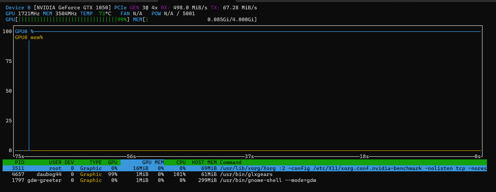

# Tentativi, diagnosi e risultato

| Tentativo | Perché non bastava | Correzione o lezione |
| --- | --- | --- |
| ROM generiche da Internet | Una VBIOS diversa può non contenere i dettagli OEM di alimentazione/piattaforma del laptop. | Usare la VBIOS HP originale estratta dal payload relativo al Pavilion 15-cs1xxx; è inclusa come riferimento privato in `firmware/`. |
| Solo `romfile` e `rombar=1` | Espongono la ROM sul bus PCI virtuale, ma il driver Optimus in questo caso cercava ACPI `_ROM`. | Stessa VBIOS tramite `fw_cfg` più SSDT AML che implementa `_ROM`; `rombar=0` intenzionale. |
| SSDT con percorso ACPI manuale | Un bridge PCI o una funzione diversa cambia lo scope e rende `_ROM` invisibile al device corretto. | Prima accensione, `lspci -PP`, conversione `slot * 8 + funzione` e SSDT per VM. |
| `glmark2` da SSH | `Could not initialize canvas`: non esiste un display X11 nella shell SSH. | Xorg NVIDIA headless sul display `:2`, quindi `nvidia-glxgears` per diagnosticare il renderer; il FPS headless non e' un benchmark. |
| `glmark2-es2-drm` | Il DRM virtuale/QXL può usare llvmpipe; una GPU muxless render-only non fornisce un CRTC adatto. | Non usarlo come prova NVIDIA in questa topologia; usare `nvidia-smi`, `nvtop` e GLX sul display NVIDIA. |
| Prima installazione driver Kali | Headers/build tools/DKMS non erano pronti per il kernel. | Installare headers, build tools, DKMS, driver e riavviare prima di leggere `nvidia-smi`. |
| Repository Debian/Kali riscritta ogni volta | Non era idempotente e poteva duplicare sorgenti APT. | Cerca prima `contrib non-free non-free-firmware`, anche in formato Deb822; aggiunge la source soltanto se assente. |
| Setup host manuale disperso | Facile dimenticare `iasl`, `pciutils`, kernel cmdline, initramfs o binding VFIO. | `gpu-vm-switch --prepare-host` installa/configura soltanto ciò che manca e richiede reboot esplicito. |
| Secure Boot con DKMS | Modulo locale firmato da una chiave non ancora fidata; la conferma MOK è pre-boot. | `--mok-manual` conserva Secure Boot e guida il passaggio noVNC; alternativa `--disable-secure-boot` solo OVMF/4m. |
| Deducere Secure Boot da `pre-enrolled-keys=0` | Il marker config non descrive per forza le variabili EFI già salvate. | Leggere il guest con `mokutil --sb-state` o variabile `SecureBoot-*`. |
| xrdp con GNOME Wayland | xrdp ha creato una sessione X11; GNOME Ubuntu ha rifiutato l'avvio perché il suo servizio Shell richiede XDG_SESSION_TYPE=wayland. | Usare GNOME Remote Login/gnome-remote-desktop in modalità system. Il percorso e i controlli sono in [rdp-wayland.md](rdp-wayland.md). |
| Primo Remote Login Wayland | `gsd-sharing` poteva fermare l'handover, ma la drop-in non era stata ricaricata dal manager utente. | `RefuseManualStop=yes` e' stato ricaricato e risulta effettivo. Evita lo stop della unit ma non cambia la negoziazione del client. |
| `mstsc` Windows dopo cleanup | Il profilo `.rdp` usa RDSTLS e l'utente ha riferito che funziona. La GUI diretta restava nera perche' il suo profilo nascosto `Documents\Default.rdp` aveva `use redirection server name:i:0`, quindi dopo il redirect negoziava NLA e comparivano `Could not find user in SAM database` / `SEC_E_NO_CREDENTIALS`. | Il 2026-08-27 `Default.rdp` e' stato corretto in `use redirection server name:i:1` e verificato in lettura. Il problema non e' xrdp, Flashback, GPU o passthrough: e' la scelta NLA invece di RDSTLS nel secondo tratto. Il prossimo collegamento diretto e' la prova visiva finale. |
| `gsd-sharing` Ubuntu 50.0 | In `pre_shutdown` fermava incondizionatamente tutti i servizi assegnati, incluso `gnome-remote-desktop-handover.service`, anche mentre il daemon RDP di sistema era presente sul bus D-Bus. | Snapshot Proxmox e backport locale `50.0-1ubuntu1+rdphandover1`: la guardia `if (!info->system_service_running)` conserva l'hand-over. Il test visivo Windows dopo l'installazione e' ancora da ripetere. |
| GNOME Flashback/Metacity e xrdp | Erano una soluzione X11 di controllo, non il server Wayland voluto; processi e file di sessione potevano rimanere orfani dopo la rimozione dei pacchetti. | Il 2026-08-27 sono stati rimossi `gnome-session-flashback`, `xrdp`, `xorgxrdp`, `.xsession`, stato xrdp e processi X11 orfani. Nessun `autoremove` e' stato eseguito per preservare il driver NVIDIA. |
| `nvidia-smi` positivo ma `glxinfo` Wayland con `llvmpipe` | `nvidia-smi` prova il driver, non quale backend ha scelto Xwayland. Due file locali (`nvidia.conf`, `nvidia-custom.conf`) sovrascrivevano `nvidia_drm modeset=1` con `modeset=0`. | Impostare KMS a `1`, rigenerare initramfs e riavviare. Dopo il boot `modeset=Y`, GNOME seleziona `nvidia-drm` primario e `glxinfo -B` restituisce GTX 1050. Il dettaglio e' in [wayland-nvidia-kms.md](wayland-nvidia-kms.md). |
| `glxgears` nel desktop a circa 60 FPS | Il monitor virtuale RDP e' 60 Hz e `glxgears` e' sincronizzato al vertical refresh. | E' normale VSync, non un limite GPU. Verificare NVIDIA con `glxinfo -B` e `nvidia-smi`/`nvtop`; `__GL_SYNC_TO_VBLANK=0` e' solo un contatore non sincronizzato. |
| `apt autoremove` dopo il cleanup grafico | I pacchetti NVIDIA potevano essere marcati automatici: la simulazione era un avviso, non un guasto gia' avvenuto. | Non eseguire autoremove alla cieca; marcare manuali `nvidia-driver-580` e `nvidia-utils-580`, simulare di nuovo. Lo script ora protegge le radici driver installate. |
| Audio RDP | La presenza del canale PipeWire e di `audiomode:i:0` non dimostra da sola che l'audio arrivi al client. | L'utente ha ascoltato e confermato l'audio remoto su Windows: playback riuscito. Il microfono resta esplicitamente non testato (`audiocapturemode:i:0`). |

## Prova di rendering storica sul display diagnostico



Lo screenshot mostra `/usr/bin/glxgears` al 99% GPU, Xorg NVIDIA sul display `:2`, circa 4 GiB di VRAM visibili e temperatura 73 °C. E' una prova storica che il display NVIDIA headless esisteva e renderizzava sulla GPU, non il benchmark del desktop Wayland corrente. I campioni di output erano:

```text
120907 frames in 5.0 seconds = 24181.367 FPS
125006 frames in 5.0 seconds = 25001.096 FPS
```

È una prova di rendering della GPU reale, non soltanto di enumerazione da `nvidia-smi`. Dopo il fix KMS, il test pertinente nel desktop Wayland e' `glxinfo -B` (renderer NVIDIA); `glxgears` viene correttamente limitato a circa 60 FPS dal VSync RDP.

## Test di trasferimento riuscito: Ubuntu -> Kali -> Ubuntu

| Direzione | Firmware/chipset guest | Cosa è stato verificato |
| --- | --- | --- |
| Ubuntu `1001` -> Kali `1000` | OVMF/Q35 -> SeaBIOS/Q35 | Cleanup della configurazione Ubuntu, assegnazione della GPU, discovery PCI/ACPI Kali e SSDT Kali. |
| Kali `1000` -> Ubuntu `1001` | SeaBIOS/Q35 -> OVMF/Q35 | Cleanup Kali, nuova discovery Ubuntu, SSDT Ubuntu e ritorno del driver NVIDIA funzionante. |

Il test ha dimostrato che lo script non dipende da un unico firmware guest e che rimuove/ripristina solo le opzioni da lui gestite. La verifica finale su Ubuntu è `NVIDIA GeForce GTX 1050, 580.173.02, 4096 MiB`; lo screenshot sopra dimostra anche rendering effettivo.

## Limite rimasto: Secure Boot off

Sono stati verificati: stato Secure Boot reale sul guest, prompt interattivo, sintassi, self-test SSDT, codice di backup e tentativo di rollback prima del primo Guest Agent. La sostituzione dell'EFI disk per `--disable-secure-boot` **non è stata eseguita sulla VM Ubuntu principale**. La prima esecuzione va trattata come modifica firmware: backup/snapshot, console noVNC disponibile e nessun dato non salvato nella VM.

MOK non è “un bug da automatizzare”: per disegno è una conferma davanti al firmware, prima che rete, SSH e QEMU Guest Agent esistano. Il supporto corretto è rendere visibile il certificato e i passaggi, lasciare la GPU già configurata in modo idempotente e far completare all'utente l'enrollment in console.
