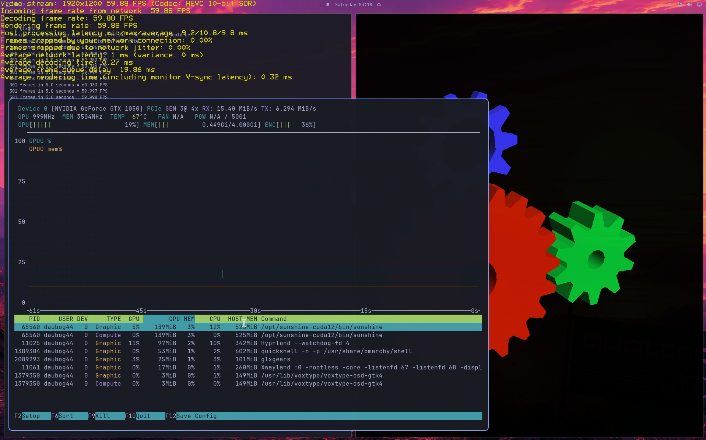
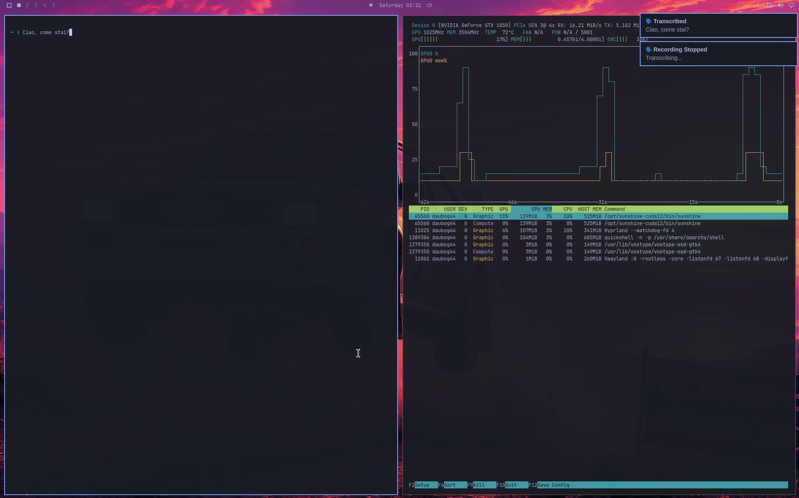
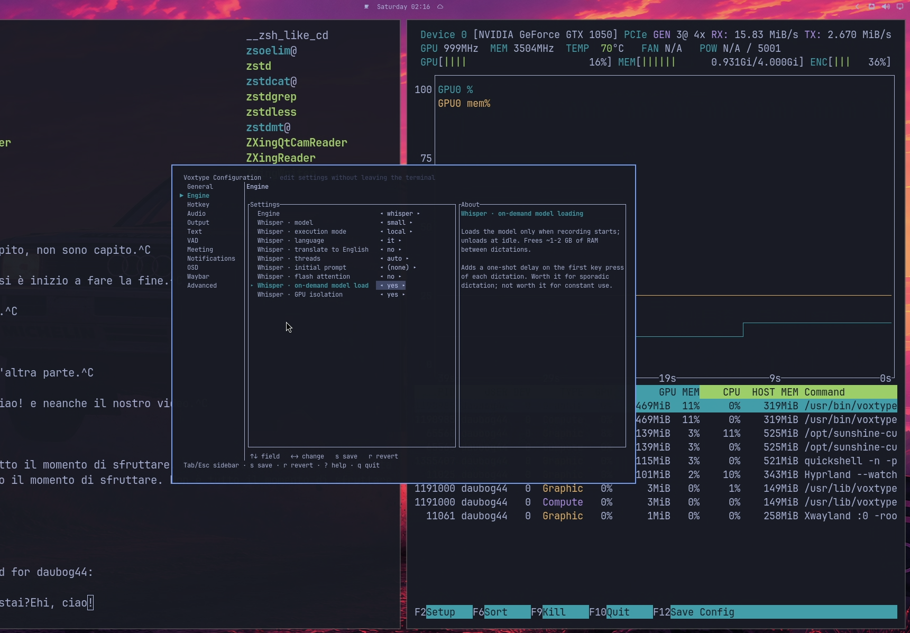

# CLI riproducibile: Proxmox, Omarchy e PC client

Questa CLI raccoglie i moduli gia' verificati senza far finta che un nodo
Proxmox, una VM Linux e un PC Windows o Fedora siano la stessa macchina. Ogni comando
si esegue nel contesto che possiede la modifica: niente password nel repository,
niente SSH nascosto e nessun reboot o switch GPU implicito.

## Configurazione unica, senza IP nel codice

Al primo comando interattivo la CLI crea il file e chiede i valori mancanti;
non richiede password, chiavi o token. In alternativa crearlo manualmente,
ignorato da Git:

```bash
cp config/omarchy.env.example config/omarchy.env
```

Compilare almeno questi valori:

```dotenv
OMARCHY_USER=your-linux-user
OMARCHY_VM_HOST=omarchy.local
OMARCHY_VM_ADDRESS=192.168.1.50
OMARCHY_CLIENT_ADDRESS=192.168.1.60
OMARCHY_RTP_PORT=40100
OMARCHY_MIC_DEVICE=Microphone (USB Audio Device)
OMARCHY_FEDORA_MIC_SOURCE=@DEFAULT_SOURCE@
OMARCHY_VM_ID=1002
OMARCHY_GPU_BDF=0000:02:00
OMARCHY_ROM_SOURCE=./firmware/gtx1050_hp_native.rom
```

Non inserire password, chiavi private o token. Il file contiene la topologia
locale e i nomi delle sorgenti microfono; puo' essere copiato sul nodo PVE,
sulla VM e su ogni PC Windows o Fedora, con i valori appropriati a ciascun PC.
`OMARCHY_MIC_DEVICE` e' il nome DirectShow di Windows; su Fedora
`OMARCHY_FEDORA_MIC_SOURCE=@DEFAULT_SOURCE@` segue il microfono PipeWire/Pulse
predefinito, oppure si sostituisce con il nome da `pactl list short sources`.

## Dove vivono i componenti e come comunicano

| Luogo | File/processo | Ruolo |
| --- | --- | --- |
| Repository | `config/omarchy.env` | Unica sorgente locale di IP, porta, utente, VM e GPU. E' ignorato da Git. |
| Nodo PVE | `scripts/gpu-vm-switch` | IOMMU/VFIO, VBIOS/SSDT e assegnazione GPU alla VM. |
| VM | `~/.local/bin/voxtype-remote-mic-*` | Ricevitore RTP, controllo domanda, PTT e dispatcher SSH ristretto. |
| VM | `~/.config/voxtype/remote-mic.env` | Porta RTP scelta dalla configurazione centrale. |
| VM | `~/.config/systemd/user/voxtype-remote-mic-rtp.service` | Ricevitore sempre pronto; il linger dell'utente lo riporta dopo reboot. |
| VM | `/run/user/<uid>/voxtype/{state,remote-mic-demand,remote-mic-control-connected}` | Stato effimero: registrazione, PTT e sessione Windows. Sparisce al logout/reboot. |
| VM | `~/.config/hypr/bindings.lua` | Blocco gestito PTT `SUPER + H` / `HOME`; ne viene salvato un backup una sola volta. |
| Windows | `%APPDATA%\Microsoft\Windows\Start Menu\Programs\Startup\Omarchy VoxType realtime microphone.cmd` | Avvia il watcher al login Windows. |
| Windows | `%USERPROFILE%\.ssh\voxtype-omarchy_ed25519` | Chiave per quel PC; autorizzata soltanto al dispatcher microfono VM. |
| Fedora | `~/.config/omarchy/omarchy.env` | Copia privata della configurazione di quel client: indirizzo locale e sorgente Pulse. |
| Fedora | `~/.config/omarchy/voxtype-omarchy_ed25519` | Chiave dedicata del PC Fedora, ristretta allo stesso dispatcher VM. |
| Fedora | `~/.config/systemd/user/voxtype-fedora-mic-rtp.service` | Watcher utente: riparte al login grafico, ma FFmpeg rimane spento finche' la VM non domanda audio. |
| Rete | SSH ristretto + UDP RTP | SSH invia solo `active`/`idle`; RTP/Opus invia l'audio. UFW ammette UDP solo dall'IP del PC configurato. |

Il flusso e' quindi:

```text
Moonlight connesso -> watcher del client apre SSH di controllo
VM: PTT VoxType o source-output Discord -> active
Windows/Fedora: FFmpeg apre il microfono configurato -> Opus/RTP UDP
VM: FFmpeg riceve -> pw-cat -> voxtype_remote_mic.monitor
VM non richiede piu' audio -> idle -> il client chiude FFmpeg
```

Il ricevitore VM e' sempre pronto, ma non puo' aprire il microfono fisico del
PC: solo FFmpeg sul client lo apre, e soltanto dopo `active`.

## Comandi

Prima vedere la sequenza completa, senza modifiche:

```bash
scripts/omarchy-setup --config config/omarchy.env plan
```

Sul nodo Proxmox, come root:

```bash
# Simulazione reale: usa qm ma non scrive, non spegne VM e non riavvia.
scripts/omarchy-setup --config config/omarchy.env proxmox gpu-prepare --dry-run
scripts/omarchy-setup --config config/omarchy.env proxmox gpu-switch --dry-run

# Applicazione esplicita.
scripts/omarchy-setup --config config/omarchy.env proxmox gpu-prepare --apply
scripts/omarchy-setup --config config/omarchy.env proxmox gpu-switch --apply
```

Nella VM Omarchy, come root:

```bash
scripts/omarchy-setup --config config/omarchy.env guest sunshine prepare --apply
scripts/omarchy-setup --config config/omarchy.env guest microphone install --apply

# Mantiene il ramo proprietario Pascal 580xx; consente gli update 580xx ma
# blocca prima della transazione i pacchetti NVIDIA generici/610 incompatibili.
scripts/omarchy-setup --config config/omarchy.env guest nvidia pin --apply
scripts/omarchy-setup --config config/omarchy.env guest nvidia verify


scripts/omarchy-setup --config config/omarchy.env guest sunshine status
scripts/omarchy-setup --config config/omarchy.env guest microphone verify

# Corregge l'installer Gaming -> Steam di Omarchy per la GTX Pascal/580xx.
scripts/omarchy-setup --config config/omarchy.env guest steam fix --apply
scripts/omarchy-setup --config config/omarchy.env guest steam verify

# Solo dopo aver verificato che quello specifico gioco fallisce su Wayland.
# Chiudere completamente Steam prima di enable/disable.
scripts/omarchy-setup --config config/omarchy.env guest steam fallback enable Sandustry --apply
scripts/omarchy-setup --config config/omarchy.env guest steam fallback status Sandustry
scripts/omarchy-setup --config config/omarchy.env guest steam fallback disable Sandustry --apply
```

### Avvio Moonlight dopo un reboot

`guest sunshine prepare --apply` configura il guest dedicato allo streaming
per avviare automaticamente `omarchy.desktop` con SDDM. Sunshine resta un
servizio della sessione Wayland (non un daemon di sistema), quindi parte quando
Hyprland e' pronto. Lo stesso modulo abilita lo stato Omarchy persistente
`stay-awake`: non compare il lock screen per inattivita' mentre la VM attende
Moonlight. Il lock prima della sospensione resta attivo.

Questo automatizza la sessione grafica **dopo** che il sistema ha montato il
root filesystem. Il prompt Plymouth per LUKS appare prima di SDDM e non puo'
essere risolto dall'autologin. Nel guest Omarchy documentato e' ora configurato
anche il passaggio che mancava: **vTPM Proxmox + token LUKS2 con
`systemd-cryptenroll`**. Di conseguenza il boot arriva a SSH e Sunshine senza
noVNC e senza memorizzare un keyfile in chiaro nel guest.

### LUKS auto-unlock con vTPM: configurazione effettiva e modello di sicurezza

Il nodo PVE conserva lo stato TPM persistente della VM come `tpmstate0`; il
guest lo vede come `/dev/tpmrm0`. Dentro l'header LUKS2 e' presente un token
`systemd-tpm2` in un keyslot aggiuntivo. La passphrase originaria resta nello
slot iniziale, quindi e' il recupero manuale se il token non e' disponibile.

```text
Proxmox tpmstate0 -> /dev/tpmrm0 nel guest
  -> token systemd-tpm2 nell'header di /dev/sda2
  -> initramfs Limine: systemd + sd-encrypt + /etc/crypttab.initramfs
  -> /dev/mapper/root -> SDDM autologin -> Hyprland -> Sunshine
```

Per una VM nuova, prima creare il TPM persistente sullo storage PVE scelto (il
nome dello storage non va fissato nel repository):

```bash
# Nodo PVE, VM spenta. Sostituire <storage> e <vmid>.
qm set <vmid> --tpmstate0 <storage>:1,version=v2.0
```

Nel guest LUKS2, il percorso supportato da Arch/Omarchy e' `systemd` +
`sd-encrypt`, non il vecchio hook `encrypt`. La configurazione locale deve
essere un drop-in ordinato dopo `omarchy_hooks.conf`, deve convertire
`udev/encrypt/keymap/consolefont` in `systemd/sd-encrypt/sd-vconsole`, e deve
conservare gli hook Omarchy come `btrfs-overlayfs` e `resume`. Per il volume
root usare quindi:

```text
# /etc/crypttab.initramfs
root UUID=<UUID-LUKS> none tpm2-device=auto

# /etc/kernel/cmdline (estratto)
rd.luks.name=<UUID-LUKS>=root root=/dev/mapper/root ...
```

Rigenerare poi con `sudo limine-mkinitcpio` (non con un path generico
`/boot/initramfs-linux.img`: questa Omarchy usa Limine in un percorso UUID) e
iscrivere il token, senza cancellare la passphrase esistente:

```bash
sudo systemd-cryptenroll --tpm2-device=auto /dev/sda2
sudo cryptsetup luksDump /dev/sda2 # deve mostrare systemd-tpm2
```

Nel caso verificato non sono stati vincolati PCR: e' piu' affidabile per una
VM SeaBIOS priva di Secure Boot, ma significa che chi controlla **sia** disco
VM **sia** `tpmstate0` sul nodo PVE puo' avviarla. Non e' quindi equivalente a
un TPM fisico che difende dall'amministratore dell'hypervisor; elimina invece
il blocco operativo del primo login mantenendo il disco cifrato a riposo fuori
da quel confine. Per un vincolo di integrita' piu' forte servono OVMF, Secure
Boot e una policy PCR pianificata e testata separatamente.

Rollback: avviare una volta con la passphrase LUKS, rimuovere il token con
`sudo systemd-cryptenroll --wipe-slot=tpm2 /dev/sda2`, rimuovere
`/etc/crypttab.initramfs` e il drop-in locale `zz-vtpm-luks.conf`, ripristinare
il precedente `cryptdevice=...` nel cmdline, quindi `sudo limine-mkinitcpio`.
Non rimuovere `tpmstate0` finche' il guest non e' stato riavviato e verificato
con la passphrase.

Dopo lo sblocco LUKS, attendere circa 15 secondi: Moonlight puo' raggiungere
Sunshine senza login noVNC. Per verificare la configurazione nella VM:

```bash
scripts/omarchy-setup --config config/omarchy.env guest sunshine verify
```

Questa scelta e' adatta a una VM dedicata e raggiungibile solo dalla LAN:
la sessione desktop resta sbloccata al boot. Per tornare al comportamento
interattivo, rimuovere il drop-in
`/etc/sddm.conf.d/zz-omarchy-moonlight-autologin.conf` e il file
`~/.local/state/omarchy/indicators/stay-awake`, quindi riavviare.

`guest steam fix` modifica esclusivamente l'ordine della transazione avviata dal
menu **Gaming -> Steam**: per una GPU Pascal non-GSP installa prima il provider
`lib32-nvidia-580xx-utils` assieme a `steam`. Questo evita la scelta automatica
del provider `lib32-nvidia-utils`, che porta al pacchetto NVIDIA 610 e confligge
con il driver `580xx` presente nella VM. L'hook
`/etc/pacman.d/hooks/99-omarchy-steam-pascal-nvidia.hook` riapplica il fix dopo
un upgrade del pacchetto `omarchy`.

### Ramo NVIDIA 580xx: protetto, ma aggiornabile

Il comando `guest nvidia pin --apply` installa una guardia Pacman
`/etc/pacman.d/hooks/98-omarchy-nvidia-pascal-580xx.hook`. Non blocca il
pacchetto `nvidia-580xx-*`: quindi i futuri aggiornamenti di sicurezza e bugfix
all'interno del ramo `580.xx` restano disponibili. Blocca invece, **prima** che
Pacman modifichi il sistema, una transazione che tenti di installare o sostituire
lo stack con `nvidia-utils`, `lib32-nvidia-utils`, `nvidia-open*`,
`nvidia-dkms` o un altro ramo numerato. E' una protezione dell'intero sistema,
non soltanto dell'installer Steam.

Steam resta un caso aggiuntivo: il menu Omarchy doveva selezionare esplicitamente
anche il provider Vulkan a 32 bit `lib32-nvidia-580xx-utils`. La guardia rende
il suo errore esplicito se in futuro una dipendenza prova a reintrodurre il
provider incompatibile; il fix Steam gli indica gia' quello corretto.

### Fallback Wayland -> XWayland, limitato a un gioco Steam

Wayland resta il backend normale della sessione Hyprland e non viene applicata
nessuna variabile globale a Chromium, Electron, Obsidian o a tutti i giochi.
Un gioco Electron puo' supportare Wayland nativo: quindi si prova prima senza
fallback. Sandustry (AppID `2764460`) in questa VM ha raggiunto il protocollo
Wayland ma il suo runtime Electron incluso ha terminato il processo subito dopo
la configurazione della finestra. Sostituire il binario Electron a mano non e'
una correzione affidabile: runtime, applicazione ASAR e moduli nativi sono un
unico pacchetto distribuito e verificato da Steam. L'aggiornamento corretto
deve arrivare dal manutentore del gioco.

Per un'app che abbia dimostrato lo stesso difetto usare il modulo `fallback`.
Esso salva le Launch Options originali nell'home dell'utente, aggiunge
`--ozone-platform=x11` al solo AppID richiesto e le ripristina esattamente con
`disable`. Steam deve essere completamente chiuso durante la modifica, per non
riscrivere `localconfig.vdf`. Non esiste un rilevamento automatico affidabile:
un gioco puo' avviarsi lentamente, restare intenzionalmente senza finestra o
avere un launcher separato. La scelta resta quindi esplicita, ma riproducibile.
Il comando accetta anche il nome esatto visibile nella Libreria Steam, senza
distinzione tra maiuscole/minuscole: legge l'AppID dal manifest del gioco
installato e si ferma se il nome e' ambiguo.

Nel dotfile Bash dell'utente Omarchy e' presente anche la scorciatoia
interattiva `steam-x11`. Non bisogna anteporre `sudo`: la funzione lo usa
soltanto per le azioni che modificano Steam. Dopo avere chiuso Steam:

```bash
steam-x11 Sandustry           # equivale a: enable Sandustry
steam-x11 status Sandustry    # non richiede sudo
steam-x11 disable Sandustry   # ripristina le opzioni precedenti
```

Aprire un nuovo terminale, oppure eseguire `source ~/.bashrc`, dopo la prima
installazione della scorciatoia.

XWayland non sposta il rendering sulla CPU: il test Sandustry ha mostrato il
client `xwayland=true` e il processo grafico sulla GTX. Aggiunge pero' un
livello di compatibilita' tra protocollo X11 e compositor Wayland; per una UI o
un gioco 2D l'impatto e' normalmente minimo, mentre per titoli molto sensibili
a frame pacing e latenza e' preferibile il backend Wayland nativo quando
funziona. Misurare sempre FPS e latenza Moonlight sul gioco concreto.

#### Misura locale: throughput OpenGL, non input latency

Il 30 agosto 2026 e' stato eseguito temporaneamente `glmark2` sulla GTX 1050,
driver NVIDIA `580.178.04`, Hyprland, uscita virtuale 1920x1200 e scena
`refract` per 10 secondi. Il pacchetto (13 MiB installati) e' stato rimosso al
termine. I due campioni sono stati:

| Backend | FPS | Media |
| --- | ---: | ---: |
| Wayland nativo | 438, 396 | 417 |
| XWayland | 448, 423 | 436 |

In questa singola scena XWayland e' risultato circa il 4% piu' alto: quindi non
esiste una penalita' di throughput fissa e universale. Non e' una misura di
Sandustry (il suo backend Wayland termina prima di poter essere confrontato),
di input-to-photon, del client Moonlight, ne' del frame pacing reale; non basta
per dichiarare XWayland migliore. La policy resta: Wayland prima, fallback solo
per l'AppID che fallisce.

Come riferimento esterno, Electron conferma che Wayland nativo elimina un
livello tra applicazione e compositor, mentre la documentazione XWayland
descrive esplicitamente il percorso app X11 -> XWayland -> compositor. Un test
indipendente su RTX 4070/KWin/500 Hz ha misurato da +1,12 a +3,13 ms di latenza
per XWayland rispetto a Wayland nativo, ma quei valori non sono trasferibili
alla GTX 1050, Hyprland o Moonlight di questa VM. Fonti:
[Electron](https://www.electronjs.org/blog/tech-talk-wayland),
[Wayland/XWayland](https://wayland.freedesktop.org/docs/book/Xwayland.html),
[misura comparativa esterna](https://marco-nett.de/blog/measuring-input-latency-on-linux-x11-vs-wayland-vrr-dxvk/).


Se l'installazione si ferma con un `404` da un mirror (un database Pacman
vecchio punta a una versione gia' rimossa), eseguire nella VM l'aggiornamento
completo gestito da Omarchy, poi riaprire il menu:

```bash
omarchy update
```

Non usare `pacman -Syu` direttamente (ne' `pacman -Sy`): Omarchy lo blocca
intenzionalmente per eseguire snapshot, keyring, migrazioni e hook attraverso
il proprio update manager.

Sul PC Windows, da PowerShell:

```powershell
# Prima volta su questo PC: crea/installa la chiave limitata, poi l'autostart.
.\clients\omarchy-client-setup.ps1 -ConfigPath .\config\omarchy.env `
  -Module Microphone -InstallKey

# Configura solo le preferenze Moonlight, oppure tutto il lato Windows.
.\clients\omarchy-client-setup.ps1 -ConfigPath .\config\omarchy.env -Module Moonlight
.\clients\omarchy-client-setup.ps1 -ConfigPath .\config\omarchy.env -Module All
```

Sul PC Fedora Workstation, come **utente desktop**:

```bash
# Senza clonare la repository: installa l'RPM versionato online, poi esegui
# il solo comando necessario. DNF installa anche le dipendenze RPM; Moonlight
# Flatpak viene aggiunto dal wizard.
sudo dnf install -y https://raw.githubusercontent.com/daubog44/proxmox-gtx1050-mobile-passthrough/main/releases/omarchy-fedora-client-latest.noarch.rpm
omarchy-onboard --apply

# Unico comando per un nuovo client: se manca, apre il wizard per il file .env;
# installa Moonlight e dipendenze, controlla via SSH il ricevitore della VM e
# riallinea sempre il modulo guest del pacchetto, anche se era gia installato.
# Poi configura firewall RTP, chiave SSH ristretta, watcher e verifiche. Questo
# percorso non chiede VMID, BDF GPU o VBIOS: sono variabili del nodo PVE, non
# del client Fedora.
scripts/omarchy-setup onboard --apply

# Anteprima della stessa CLI centrale: non modifica nulla.
scripts/omarchy-setup --config config/omarchy.env client fedora all

# Preflight reale sul PC Fedora: elenca RPM, comandi, libopus, Flatpak
# Moonlight e watcher; se manca qualcosa stampa il comando d'installazione.
scripts/omarchy-setup --config config/omarchy.env client fedora check

# Alternativa per riparare/installare manualmente i singoli moduli: installa
# Moonlight da Flathub, FFmpeg/SSH/KDE Connect da Fedora e il watcher.
# --install-key chiede una sola volta la password SSH della VM, per registrare
# una chiave ristretta; non viene salvata.
scripts/omarchy-setup --config config/omarchy.env \
  client fedora all --install-key --apply

# Facoltativo: consente KDE Connect soltanto dall'IP della VM configurata.
scripts/omarchy-setup --config config/omarchy.env \
  client fedora kde-connect --configure-kde-firewall --apply

# Diagnosi senza modifiche e lista delle sorgenti PipeWire/Pulse.
scripts/omarchy-setup --config config/omarchy.env client fedora show

# Dalla GUI Fedora il pulsante "Sincronizza Omarchy" equivale a questo modulo:
# riallinea NVIDIA 580xx, Sunshine headless e receiver senza toccare PVE.
/usr/libexec/omarchy-fedora-client/clients/omarchy-client-setup-fedora.sh \
  --config ~/.config/omarchy/omarchy.env --module guest
clients/voxtype-fedora-mic-rtp.sh --list-sources
```

Il modulo Fedora installa Moonlight come Flatpak utente
`com.moonlight_stream.Moonlight`. In Omarchy Control, la sezione **Gaming**
rileva gli schermi fisici e applica in modo esplicito un profilo 1080p60/20
Mbps oppure nativo fino a 4K60/80 Mbps; conserva host e pairing e riavvia il
client per rendere effettive le preferenze. Il setup abilita idempotentemente il servizio
firewalld `mdns` (`5353/UDP` limitato ai gruppi multicast standard), necessario
per ricevere l'annuncio Sunshine `_nvstream._tcp`; non apre la porta a unicast
generico. Durante `onboard` KDE Connect viene rilevato, il
firewall viene limitato automaticamente all'IP Omarchy e la richiesta di
pairing viene inviata al dispositivo trovato. Il wizard usa la sessione SSH
gia' autenticata per inviare anche la richiesta reciproca da Omarchy: i due ID
KDE Connect restano distinti, ma non serve un secondo inserimento della password
ne' un clic manuale. Se il demone remoto non risponde, resta disponibile il
fallback esplicito con notifica da approvare sul desktop Omarchy. Il
servizio microfono parte dopo il login grafico Fedora e
non usa `sudo` a ogni avvio: l'unico `sudo` possibile e' quello esplicito per
installare pacchetti o, se richiesto, le due regole firewall.

Se il wizard parte dalla GUI e le password coincidono, il singolo campo
temporaneo viene riutilizzato per SSH, `sudo` della VM e `sudo` Fedora mediante
`SSH_ASKPASS`/stdin. Su Fedora lo script viene eseguito direttamente dal backend
Tauri: non attraversa il server di un terminale grafico, quindi l'ambiente non
si perde e non compaiono prompt duplicati. Il segreto non compare nelle righe
di comando, viene eliminato alla fine e il campo viene svuotato. Se le password sono diverse, usare separatamente
`OMARCHY_SSH_PASSWORD`, `OMARCHY_SUDO_PASSWORD` e
`OMARCHY_LOCAL_SUDO_PASSWORD` in una sessione manuale protetta.

L'RPM richiede la capacita' `/usr/bin/ffmpeg`, non il nome `ffmpeg-free`: in
questo modo accetta sia la build Fedora sia FFmpeg completo di RPM Fusion senza
tentare una sostituzione in conflitto. Il wizard verifica poi realmente che
l'encoder `libopus` sia presente. L'RPM `latest` e' costruito su Fedora 44;
l'hash SHA-256 della copia corrente
e' pubblicato in [`releases/SHA256SUMS`](../releases/SHA256SUMS). Il pacchetto
non include password o indirizzi: il wizard li salva localmente con permessi
`0600` in `~/.config/omarchy/omarchy.env`.

Non esiste piu' un prerequisito nascosto `guest microphone install --apply`:
durante `omarchy-onboard --apply` il client controlla in SSH che la VM abbia
dispatcher, ricevitore RTP e servizio utente. A ogni esecuzione copia in una
directory temporanea privata della VM gli stessi script guest contenuti
nell'RPM, esegue il modulo guest microfono con `sudo`, poi elimina quella
directory. In questo modo aggiorna anche un dispatcher gia' installato ma
vecchio. Il pulsante GUI **Sincronizza Omarchy** usa lo stesso percorso con
`guest all`: applica inoltre la guardia del ramo NVIDIA 580xx e la configurazione
Sunshine/Hyprland headless. Non e' necessario un secondo motore come Ansible e
la sincronizzazione non comprende il nodo PVE, VFIO, VBIOS, SSDT, vTPM o LUKS.
La GUI richiede il singolo campo temporaneo prima di una mutazione privilegiata;
la CLI manuale, in sua assenza, puo' chiedere la password SSH e quella sudo
della VM, ma non le salva. Se la VM non ha gia' i programmi che il ricevitore usa (`voxtype`,
`ffmpeg`, `pactl`, `pw-cat`, `systemd --user`, `ufw`), il comando termina con
l'errore del programma mancante: e' una dipendenza della VM, non un requisito
implicito del client Fedora.

### Come viene creato l'RPM

Il file [packaging/build-fedora-rpm.sh](../packaging/build-fedora-rpm.sh)
richiede solo `rpmbuild` (su Fedora: `sudo dnf install -y rpm-build`) e avvia:

```bash
OMARCHY_RPM_OUTPUT=/tmp/out packaging/build-fedora-rpm.sh 0.1.8
```

Lo script crea un `rpmbuild` temporaneo, passa alla specifica
[omarchy-fedora-client.spec](../packaging/omarchy-fedora-client.spec) il
repository come `_sourcedir` e la versione come macro RPM, quindi esegue
`rpmbuild -bb`. La sezione `%install` della spec copia gli entry point in
`/usr/bin` e i client, il receiver guest e le unit systemd in
`/usr/libexec/omarchy-fedora-client`; `%files` dichiara quella lista al
database RPM. Per la pubblicazione la copia versionata e `latest` ricevono lo
stesso SHA-256 in [`releases/SHA256SUMS`](../releases/SHA256SUMS). Il pacchetto
e' `noarch`: contiene Bash e unit file, non driver o binari dipendenti dalla
CPU.

`--apply` e' necessario per le mutazioni Linux. Senza opzioni mutanti, la CLI
stampa la sequenza prevista e funziona anche fuori da PVE/Omarchy. `--dry-run`
esegue invece la simulazione reale di `gpu-vm-switch`: non scrive, ma va
lanciata come root sul nodo PVE perche' deve interrogare `qm` e l'hardware.

## Aggiungere un secondo PC Windows o Fedora

1. Su Fedora installare l'RPM e avviare `omarchy-onboard --apply`; il wizard
   crea il file locale. Su Windows copiare `config/omarchy.env.example` nel
   nuovo PC e creare `config/omarchy.env`.
2. Usare stesso host/porta/utente VM, ma un diverso `OMARCHY_CLIENT_ADDRESS` e
   `OMARCHY_MIC_DEVICE` (Windows) oppure `OMARCHY_FEDORA_MIC_SOURCE` (Fedora).
3. Il wizard Fedora aggiunge la regola UFW via SSH; su Windows o in caso di
   configurazione manuale, nella VM aggiungere la regola UFW:

   ```bash
   scripts/omarchy-setup --config config/omarchy.env guest microphone add-client --apply
   ```

4. Sul nuovo PC eseguire `Microphone -InstallKey` (Windows) oppure
   `client fedora microphone --install-key --apply` (Fedora).

Ogni PC ha la propria chiave SSH e il proprio watcher. Il progetto supporta
piu' PC autorizzati, ma **una sola sorgente vocale Moonlight alla volta**: una
singola richiesta PipeWire di Discord/VoxType non identifica quale client
remoto dovrebbe rispondere. Se due watcher restano connessi insieme, entrambi
potrebbero ricevere `active` e inviare audio; non farlo.

## Prove versionate



Questo screenshot mostra Moonlight a `1920x1200`, circa `59.88 FPS`, codec
HEVC, zero drop rete nell'overlay e Sunshine/NVENC visibile in NVTOP. Nel
fermo immagine l'OSD VoxType occupa pochi MiB: e' il comportamento atteso a
riposo con `on_demand_loading = true`, non il modello Whisper pre-caricato.



Qui la notifica mostra `Ciao, come stai?`; il grafico NVTOP registra i picchi
di calcolo del transcriber. Lo screenshot e' successivo alla risposta, quindi
il processo pesante puo' essere gia' stato scaricato: non va interpretato come
una misura del picco massimo di VRAM.



Questa prova mostra il worker `voxtype` mentre occupa circa `469 MiB` di VRAM,
oltre ai pochi MiB dell'OSD. Dimostra il caricamento GPU durante l'uso; il
comportamento a riposo e' documentato nello screenshot precedente.
